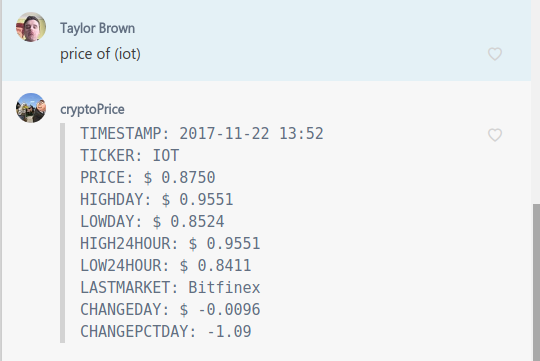
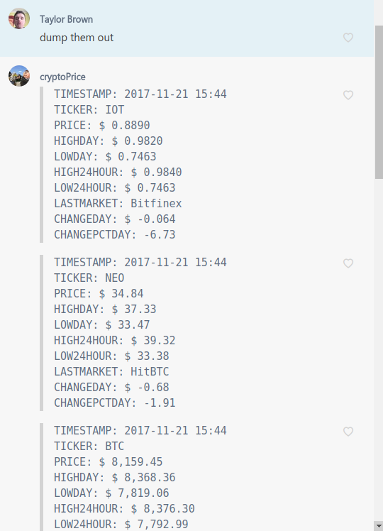

## Complete Messaging Bot that sends crypto currency information to a designated groupme.

### There are two commands built into the bot:

#### "price of (crypto_ticker)"

- This command is a very easy way to show a group how a certain token is doing
- Use this to brag about how well your favorite token is doing or be saddened about the downturn the coin took for the day

#### "dump them out"

- Comes with a few built in crypto tickers that it will display all at once
- These tokens change over time to the 10 that the group request the price of most recently
- This is extremely helpful to get a quick idea about how the groups different tokens are doing that day

### What you need to use this application:
#### 1) A groupme with a number of fellow crypto enthusiast
#### 2) Ability to deploy to a web hosting site

### 1. Register a new GroupMe Bot

* Head over to [dev.groupme.com](https://dev.groupme.com/) and login with your GroupMe credentials
* [Go to the `bots` tab and select `Create Bot`](screenshots/dev.groupme.com.png)
* [Choose a group, and avatar uri for the bot. The callback url will be that of the server you are deploying on](screenshots/bot-create.jpg)
* Select `Submit` to create your bot
* [Select your bot from the list of bots and save the bot id for later](screenshots/bot-created.jpg)
* Check the group that you added the bot to. There should be a message in chat that your bot was added to the group
* Optional step: use the 'Test Your Bot' form (or use the provided `curl` command) on the newly created bot page to send a message to chat! This is an easy way to see how the bot interacts with GroupMe

### Deploying to Heroku

[Heroku](https://www.heroku.com/) is a nice option because of its PaaS 'push and forget' style of deployment. Heroku has a limited free tier that is great for deploying chat bots (the paid tier isn't too bad). Follow [these steps](https://devcenter.heroku.com/articles/getting-started-with-nodejs#introduction) to get your machine setup with Heroku and deploy your chat bot. Heroku even lets you easily set environment variables within their dashbaord or command line interface. This is super useful for setting a bot id configuration variable on Heroku.

### Deploying to dokku

[Dokku](http://dokku.viewdocs.io/dokku/) is another great option because its open source! Similar to Heroku, dokku allows you to 'push and forget', but the setup for dokku is more involved as it requires you to setup your own cloud server and install dokku before you can deploy. See [this guide](http://dokku.viewdocs.io/dokku/deployment/application-deployment/) for deploying to dokku. Like Heroku, dokku allows you to easily set environment variables like your bot id.

### Deploying to a cloud server

Heroku and dokku are great options for deployment of your chat bot, but you can simply spin up a small cloud server and run your chat bot with little setup. Some great, inexpensive cloud providers include [DigitalOcean](https://www.digitalocean.com/), [Amazon AWS](https://aws.amazon.com/), [Microsoft Azure](https://azure.microsoft.com/), [Linode](https://www.linode.com/), [Rackspace](https://www.rackspace.com/), and more! Setting up, deploying, and maintaining your app on your own cloud server is more involved than a Heroku or dokku setup, but it does allow for more customization.

After spinning up a linux box, you would:

1. Install [Node.js](https://nodejs.org/)
2. Install a process manager like [forever](https://github.com/foreverjs/forever) to run your chat bot in the background
3. `git clone` your chat bot to the server
4. Start the chat bot with the process manager

### Resources For Further Development
- Crypto Currency information is being pulled from [the CryptoCompare API](https://www.cryptocompare.com/api/#)
- The starter bot and the deploymeant steps came from [ACMatUC/groupme-bot-starter](https://github.com/ACMatUC/groupme-bot-starter.git)
- The [Groupme API](https://dev.groupme.com/) can be of further help to find other ways to expand upon this process

## License

[GNU GPLv3 License](LICENSE.txt)

